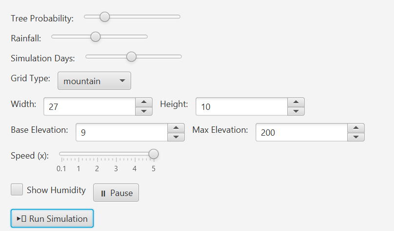
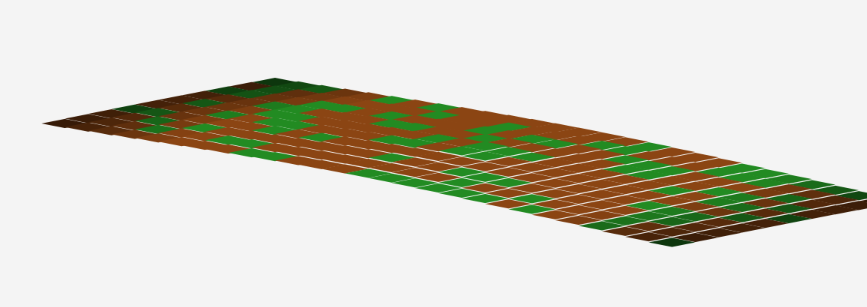
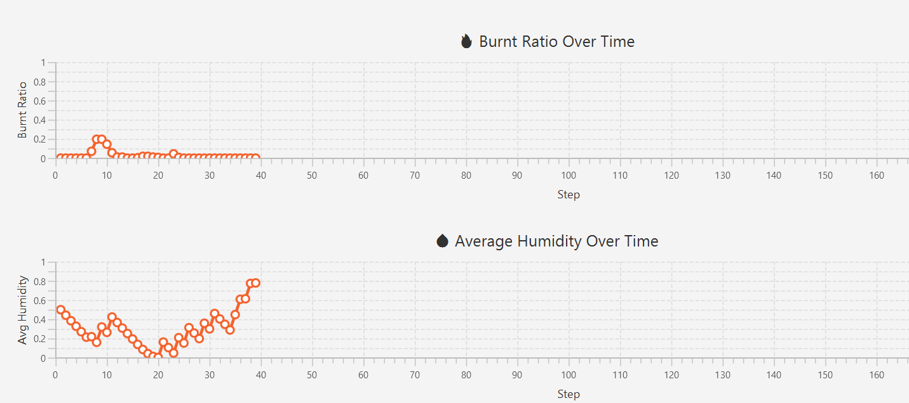

# FireForestSimulation
This project is a Scala-based simulation framework for generating 2D terrain grids used in modeling environmental phenomena such as elevation variation, vegetation distribution, humidity, and fire propagation. The grid can be shaped using multiple elevation patterns including flat, sinusoidal, mountain, and valley profiles.
Python has been used to create graphs for analysis.

It's been done for physics and functional programming ISC second year courses in HESSO.

The simulation visualizes terrain and dynamic changes across time steps, such as vegetation burning, weather impacts, and moisture variations. It is modular and can be easily extended for use in environmental modeling, virtual world simulations, or educational purposes.

## Features

- Configurable grid dimensions and elevation ranges
- Support for different terrain types: flat, sinusoidal, mountain, and valley
- Per-cell environmental data: elevation, vegetation state, humidity
- Fire spread simulation support
- Real-time rendering using ScalaFX
- Chart visualization of humidity and burnt areas over time

## Setup

### Requirements

- Scala 2.13+
- sbt (Scala Build Tool)

### Getting Started

1. Clone the repository:

    ```bash
    git clone https://github.com/NatXiao/fireForestSimulation.git
    cd terrain-grid-generator
    ```

2. Compile the project:
    ```
    sbt compile
    ```
3. Run the application
    ```
    sbt run
    ```
4. Choose with Simulation you want to run
   - Terminal
   - Create a CSV file for analysis
   - UI with scalaFX
   
## Project Structure

The project is organized as follows:  
```
├── config/  
│   ├── GridGenerationConfig.scala   # Configuration class for controlling grid properties  
│   └── SimulationParameters.scala  
├── GridGeneration/  
│   └── GridGeneration.scala         # Terrain grid generation logic (flat, sinusoidal, mountain, valley)  
├── model/  
│   ├── Cell.scala                   # Definition of a terrain cell (position, state, elevation, humidity)  
│   ├── Grid.scala                   # 2D grid model with utility functions  
│   └── Weather.scala  
├── Renderer/  
│   └── CanvasRenderer.scala         # Responsible for rendering the grid onto the canvas  
├── simulation/  
│   └── VisualSimulationRunner.scala # Runs the simulation and generates frames  
├── visualSimulation/  
│   └── SimulationUI.scala           # Main ScalaFX application with UI controls and charts  
├── build.sbt  
└── README.md  
```
## Screenshots & Videos

### Simulation with ScalaFX UI
#### Video
in Ressources/FireSimulation.mp4
#### screenshots




### Graphs with plots (python)


## Authors
Natasha Landry
